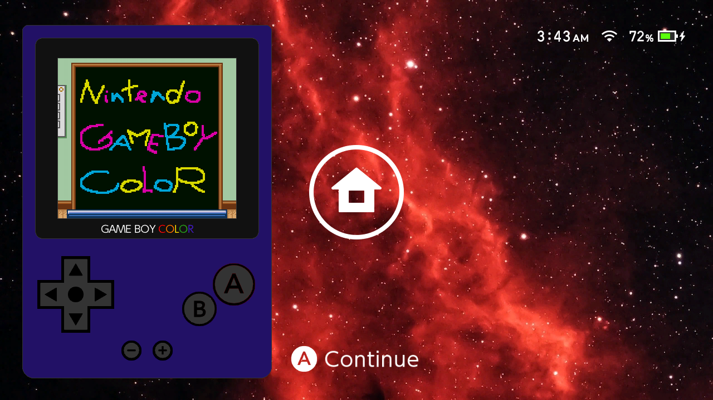

# UltraGB Overlay
[](https://gbatemp.net/forums/nintendo-switch.283/?prefix_id=44)
[](https://github.com/topics/cpp)
[](https://www.gnu.org/licenses/old-licenses/gpl-2.0.en.html)
[](https://github.com/ppkantorski/UltraGB-Overlay/releases/latest)
[](https://somsubhra.github.io/github-release-stats/?username=ppkantorski&repository=UltraGB-Overlay&page=1&per_page=300)
[](https://hb-app.store/switch/UltraGBOverlay)
[](https://github.com/ppkantorski/UltraGB-Overlay/issues)
[](https://github.com/ppkantorski/UltraGB-Overlay/stargazers)

A Game Boy / Game Boy Color emulator overlay for the Nintendo Switch, built on [libultrahand](https://github.com/ppkantorski/libultrahand).

[](https://github.com/ppkantorski/UltraGB-Overlay)

Play GB and GBC games on top of any running application.

---

## Features

### Emulation
- Full **Game Boy** (DMG) and **Game Boy Color** (GBC/CGB) emulation via an expanded fork of [Walnut-CGB](https://github.com/Mr-PauI/Walnut-CGB) (a fork of [Peanut-GB](https://github.com/deltabeard/Peanut-GB))
- Supports ROM-only, MBC1, MBC2, MBC3 (with RTC), and MBC5 (including rumble) cartridge types
- Accurate 59.73 Hz Game Boy clock rate, decoupled from the display vsync
- LCD ghosting / frame blending: per-game 50/50 blend of consecutive frames to reproduce the phosphor persistence that 30 Hz flickering transparency effects were designed for
- Fast-forward (4x) via ZR double-click-hold; audio pauses for the duration and resumes cleanly on release
- No Sprite Limit: per-game toggle that lifts the 10-sprites-per-scanline hardware cap so flickering transparency effects show all sprites every frame

### Display Modes

**Overlay mode**: emulator drawn inside the standard Ultrahand overlay panel (448x720 framebuffer) alongside the UltraGB menu chrome.
- **2x pixel-perfect**: 320x288 viewport, integer scale with letterbox; toggleable in-game by tapping the game screen

**Fixed overlay** (default): overlay panel is anchored to the left edge of the screen, identical to all other Ultrahand overlays.

**Free overlay**: the overlay panel floats freely anywhere on screen. Repositionable by touch hold (≈1 s) on the game screen or KEY_PLUS hold (1 s) + left stick. Position is saved between sessions.

**Windowed mode**: framebuffer-accurate floating window placed anywhere on screen with no UI chrome.
- Integer scales: 1x through 6x (scale range is heap- and mode-gated; see Requirements)
- Repositionable by touch hold (≈1 s) or KEY_PLUS hold (2 s) + left stick
- RS / LS click to step scale up / down in-game (relaunches at new scale)
- Position and scale saved to `config.ini`

### Palette Modes
Cycled per game from the per-game config screen. All modes work for both DMG and CGB games.

| Mode | Behaviour |
|---|---|
| `GBC` (default) | CGB games use hardware colour. DMG games receive the real GBC boot ROM title-based colorisation (per-game lookup from hardware-verified palette database); unrecognised or unlicensed games fall back to greyscale. |
| `SGB` | Same title lookup as GBC, applied to all games regardless of licensee (bypasses the Nintendo licensee gate). A warm amber palette is used as the fallback for unrecognised titles. |
| `DMG` | Classic four-shade green Game Boy LCD tint. |
| `Native` | True greyscale: raw luminance values, no tint. |

### LCD Grid Effect
Simulates the dark inter-pixel gap of a real Game Boy Color LCD by dimming the last row and column of each scaled source pixel block to approximately 12.5% brightness. Applies in both overlay and windowed modes; automatically invisible at windowed 1x (no room for a gap at 1:1 scale).

### Virtual On-Screen Controls (Overlay Mode)
D-pad, A, B, Start, and Select are drawn below the game screen and mapped to touch input each frame.

### Audio
- **Game Boy volume**: global GB audio output level (0–100).
- **Active Title volume**: per-process master volume of the running background Switch title, controlled independently. Adjusted live while the overlay is open and automatically restored to its pre-game level when the overlay closes.
- **Audio Balance**: per-game GB audio trim (−150% … 0% … +150%) stored in the per-game config. Applied as a power-of-2 gain multiplier on top of the master volume so individual games can be normalised without affecting global volume.

### Themes and Wallpapers
The overlay UI chrome (background, button colours, border) is fully themeable via `.ini` files placed in `sdmc:/config/ultragb/ovl_themes/`. A wallpaper (448x720 `.rgba` format) can be selected from `sdmc:/config/ultragb/ovl_wallpapers/` and is displayed behind the game screen when expanded memory permits.

---

## Controls

### Overlay Mode (In-Game)

| Input | Action |
|---|---|
| A | GB A |
| B | GB B |
| X / + | GB Start |
| Y / − | GB Select |
| D-Pad | GB D-Pad |
| Touch (virtual buttons) | GB D-Pad / A / B / Start / Select |
| ZR double-click-hold | Fast-forward (4x) |
| ZL double-click, then hold (≈0.5 s) | Toggle controller pass-through to background app |
| Quick tap on game screen | Toggle 2.5x ↔ 2x scale |
| Launch combo | Return to ROM selector (normal) / close overlay (quick-launch or direct mode) |

**Free overlay only:**

| Input | Action |
|---|---|
| Touch hold on game screen (≈1 s) | Enter drag mode: move overlay, release to save position |
| KEY_PLUS hold (1 s) + left stick | Joystick reposition mode |
| RS click (solo) | Switch to free overlay mode |
| LS click (solo) | Switch to fixed overlay mode |

### Windowed Mode (In-Game)

| Input | Action |
|---|---|
| A | GB A |
| B | GB B |
| X / + | GB Start |
| Y / − | GB Select |
| D-Pad | GB D-Pad |
| ZR double-click-hold | Fast-forward (4x) |
| ZL double-click, then hold (≈0.5 s) | Toggle controller pass-through to background app |
| Touch hold inside window (≈1 s) | Enter drag mode: move window, release to save position |
| KEY_PLUS hold (2 s) + left stick | Joystick reposition mode |
| RS click (solo) | Step scale up (1x → 2x → … → max) |
| LS click (solo) | Step scale down |
| Launch combo | Return to UltraGB menu / close overlay (quick-exit mode) |

### ROM Selector

| Input | Action |
|---|---|
| A | Launch ROM |
| Y | Open per-game config |
| Right / Settings footer | Go to Settings page |
| Left / Games footer | Return to ROM list (from Settings) |
| B | Close overlay |

---

## Save System

- **Battery saves (SRAM)**: written on ROM unload; stored at `sdmc:/config/ultragb/saves/internal/`
- **Quick-resume state**: full CPU/PPU/APU snapshot saved automatically when the overlay closes; restored on next launch; stored at `sdmc:/config/ultragb/states/internal/`
- **User save states**: 10 manual slots per game; stored at `sdmc:/config/ultragb/states/`
- **SRAM backup slots**: 10 manual SRAM backup slots per game, independent of save states

---

## Per-Game Configuration

Press **Y** on any ROM in the selector to open its config screen.

| Item | Description |
|---|---|
| Save States | 10 named slots: save, load, or delete any slot |
| Save Data | 10 SRAM backup slots: manual snapshots of battery save data |
| Reset | Cold boot the game (deletes the quick-resume state) |
| Pallet Mode | Cycle GBC → SGB → DMG → Native; applied live without restarting |
| No Sprite Limit | Lift the 10-sprites-per-scanline hardware cap; on by default |
| LCD Ghosting | Enable 50/50 frame blending for accurate flicker reproduction (memory-gated: see below) |
| Audio Balance | Per-game GB volume trim from −150% to +150%; press Y while focused to reset to 0% |

---

## Settings

### Volume

| Item | Description |
|---|---|
| Game Boy | GB audio output level (0–100); tap the speaker icon or press Y (when focused) to mute/unmute |
| Active Title | Background Switch title volume (0–100); tap the speaker icon or press Y (when focused) to mute/unmute; reverts to pre-game level on overlay close |

### Display

| Item | Description |
|---|---|
| Mode | Toggle between Overlay and Windowed; takes effect on next ROM launch |
| LCD Grid | Enable/disable the LCD inter-pixel gap simulation |
| Overlay | Submenu: Position (Fixed / Free) and Theme |
| Windowed | Submenu: Scale (1x–6x, heap-gated) and Docked Resolution (720p / 1080p) |

### Miscellaneous

| Item | Description |
|---|---|
| Quick Combo | Assign a button combo to launch directly to the last played ROM from anywhere |
| Button Haptics | Enable/disable rumble feedback on controller button presses |
| Touch Haptics | Enable/disable rumble feedback on screen touch (virtual buttons, drag reposition) |

### Overlay Submenu

| Item | Description |
|---|---|
| Position | Fixed (anchored left edge) or Free (repositionable floating panel) |
| Theme | Select a UI theme from `sdmc:/config/ultragb/ovl_themes/`; "default" always available |
| Wallpaper | Select a background wallpaper from `sdmc:/config/ultragb/ovl_wallpapers/` (requires 8 MB+ heap) |

### Windowed Submenu

| Item | Description |
|---|---|
| Scale | Cycle 1x → 2x → … → max; capped by available heap and ROM size (see Requirements) |
| Docked Resolution | 720p (default, 1.5x VI layer) or 1080p (pixel-perfect, 1:1 VI layer); takes effect on next windowed launch |

### Quick Combo / Quick Launch
Assigning a combo in Settings registers it system-wide and deconflicts it from other overlays and packages automatically. When triggered, the overlay launches straight into the last played ROM, bypassing the selector. The launch combo then closes the overlay entirely rather than returning to the menu.

---

## Memory Tiers

The Switch overlay heap is capped per system configuration. UltraGB adapts automatically.

| Heap | Windowed max scale | In-game wallpaper | LCD Ghosting |
|---|---|---|---|
| 4 MB | 3x |: |: |
| 6 MB | 4x |: | ROMs < 2 MB only |
| 8 MB | 5x (6x when docked + 1080p + ROM < 4 MB) | ✓ | ROMs < 4 MB only |
| 10 MB+ | 5x (6x when docked + 1080p) | ✓ | All ROMs |

ROMs that exceed the current tier's playable size are shown in the selector with a warning colour and cannot be launched.

---

## Requirements

- Nintendo Switch with [Atmosphère](https://github.com/Atmosphere-NX/Atmosphere) custom firmware
- [Ultrahand Overlay](https://github.com/ppkantorski/Ultrahand-Overlay) and [nx-ovlloader v2.0.0](https://github.com/ppkantorski/nx-ovlloader) installed
- ROMs in `.gb` or `.gbc` format placed anywhere accessible on the SD card

---

## Installation

1. Download the latest `ultragb.ovl` from [Releases](../../releases)
2. Copy it to `sdmc:/switch/.overlays/`
3. Launch via Ultrahand

The ROM directory defaults to `sdmc:/roms/gb/` and can be changed in `sdmc:/config/ultragb/config.ini` (`rom_dir` key).

---

## Building

**Requirements:** [devkitPro](https://devkitpro.org) with `devkitARM`, `libnx`, and the libultrahand library.

```sh
export DEVKITPRO=/opt/devkitpro
make -j6
```

Output: `gbemu.ovl`

The build targets C++26, ARMv8-A with SIMD/CRC/crypto extensions tuned for Cortex-A57, full LTO with 6 parallel LTRANS jobs, and links against `libcurl`, `mbedtls`, and `libnx`.

---

## File Layout

```
sdmc:/
├── switch/
│   └── .overlays/
│       └── ultragb.ovl
├── config/
│   └── ultragb/
│       ├── config.ini              ← global settings (rom_dir, volume, scale, etc.)
│       ├── ovl_theme.ini           ← active overlay theme (copied from ovl_themes/ on select)
│       ├── ovl_wallpaper.rgba      ← active overlay wallpaper (copied from ovl_wallpapers/ on select)
│       ├── ovl_themes/             ← user-provided .ini theme files
│       ├── ovl_wallpapers/         ← user-provided .rgba wallpaper files
│       ├── saves/
│       │   └── internal/           ← pre-set SRAM battery saves
│       │   └── <game>/             ← user save-data slots
│       ├── states/
│       │   ├── internal/           ← quick-resume state (one per game, auto-managed)
│       │   └── <game>/             ← user save-state slots
│       └── settings/
│           └── <game>.ini          ← per-game settings (palette, ghosting, audio balance, etc.)
└── roms/
    └── gb/                         ← pre-set GB/GBC roms directory (.gb / .gbc only)
```

---

## Credits

- **[ppkantorski](https://github.com/ppkantorski)**:
    - [UltraGB Overlay](https://github.com/ppkantorski/UltraGB-Overlay), [Ultrahand Overlay](https://github.com/ppkantorski/Ultrahand-Overlay), [libultrahand](https://github.com/ppkantorski/libultrahand), [Walnut-CGB core revision](https://github.com/ppkantorski/UltraGB-Overlay/blob/main/source/walnut_cgb.h)
- **[Mr-PauI](https://github.com/Mr-PauI)**:
    - [Walnut-CGB](https://github.com/Mr-PauI/Walnut-CGB) (GBC core, CGB palette system, dual-fetch optimisations)
- **[deltabeard](https://github.com/deltabeard)**:
    - [Peanut-GB](https://github.com/deltabeard/Peanut-GB) (original GB core)
- **[libretro](https://github.com/libretro)**:
    - [Gambatte](https://github.com/libretro/gambatte-libretro) (pallet tables from `gbcpalettes.h` used in `gb_core.h`)
- **[LIJI32](https://github.com/LIJI32)**:
    - [SameBoy](https://github.com/LIJI32/SameBoy) (portions used for reference in correcting Walnut-CGB)

---

## Contributing

Contributions are welcome! If you have any ideas, suggestions, or bug reports, please raise an [issue](https://github.com/ppkantorski/UltraGB-Overlay/issues/new/choose), submit a [pull request](https://github.com/ppkantorski/UltraGB-Overlay/compare) or reach out to me directly on [GBATemp](https://gbatemp.net/threads/ultragb-overlay/).

[](https://ko-fi.com/X8X3VR194)

---

## License

UltraGB Overlay is released under the [GPLv2](LICENSE).
